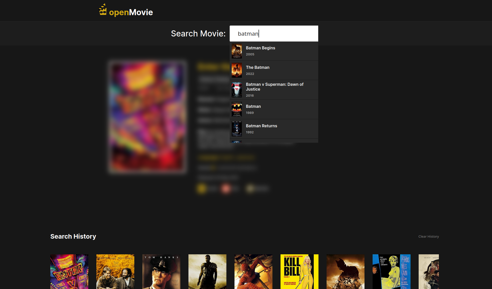
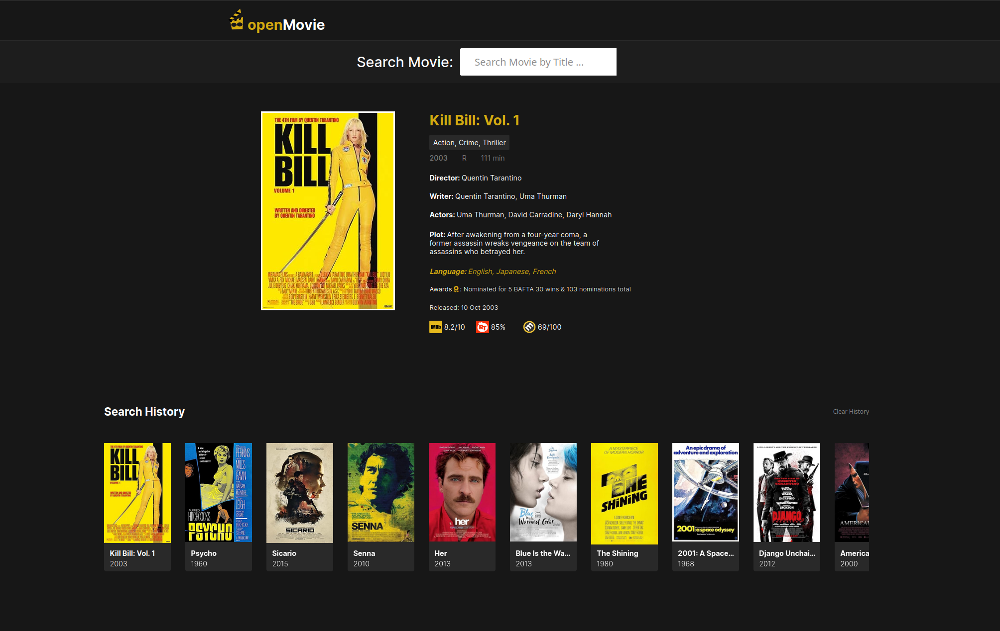
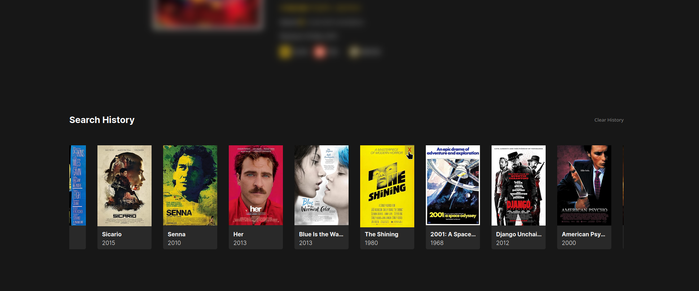

# Open Movie

## Movie Search App

This web application allows users to search for movies using the OMDB API and displays a history of searched movies. Users can view movie details, delete movies from history, and reorder the history based on user interactions.

## Features

- **Search History**: Keeps track of movies searched by the user.
- **Movie Details**: Displays detailed information about each movie, including posters, ratings, plot, and more.
- **Delete Functionality**: Allows users to delete movies from the search history.
- **Reorder History**: Clicking on a movie thumbnail reorders it to the last position in the history list.





## Getting Started

- **Run Locally**: Clone or download the project repository from GitHub.
- **No Account Needed**: The application can be run locally without the need for any user accounts.
- **Open HTML File**: Open the `index.html` file in a web browser to start using the application locally.
- **Interact**: Search for movies, view details, delete entries, and reorder the search history to explore all functionalities.

To run the application locally, follow these steps:

1. Clone the repository:

   ```
   git clone https://github.com/Wayfarerdesert/openMovie
   ```

2. Navigate into the project directory:

   ```
   cd movie-search-history
   ```

3. Open the `index.html` file in your web browser.

4. Start searching for movies and interact with the application features!

## Functionality

### Movie Details

- **Fetching**: Clicking on a movie thumbnail fetches detailed information about the movie from the OMDB API.
- **Display**: Details displayed include movie poster, title, year, rating, release date, genre, plot, language, and awards.
- **API**: Uses the OMDB API (`https://www.omdbapi.com/`) for retrieving movie data based on IMDb IDs.

### Watchlist

- **Add to Watchlist**: Users can add movies to a personal watchlist by clicking a button in the movie details section.
- **Remove from Watchlist**: Movies can be removed from the watchlist using the same button.
- **Persistent Storage**: The watchlist is saved locally using `localStorage` to ensure movies persist across sessions.
- **Display**: The watchlist dynamically renders all added movies, showing their title, poster, and details like release year and runtime.

### Search History

- **Storage**: Movies searched by the user are stored locally using `localStorage`.
- **Display**: Each movie in the history includes its title, year and poster.
- **Rendering**: The search history is rendered dynamically in the UI using JavaScript.

### Delete Functionality

- **Interaction**: Users can delete movies from the search history by clicking the delete button (`X`) on each movie thumbnail.
- **Action**: Deleted movies are removed from both the UI and local storage (`localStorage`).

## Technologies Used

- **Frontend**: HTML, CSS, JavaScript
- **API Integration**: Fetch API for making requests to the OMDB API
- **Data Storage**: `localStorage` for storing and retrieving search history locally in the browser

## Acknowledgments

- **OMDB API**: Provides movie data for this project.
- **FontAwesome**: Used for icons, such as the delete button icon.
